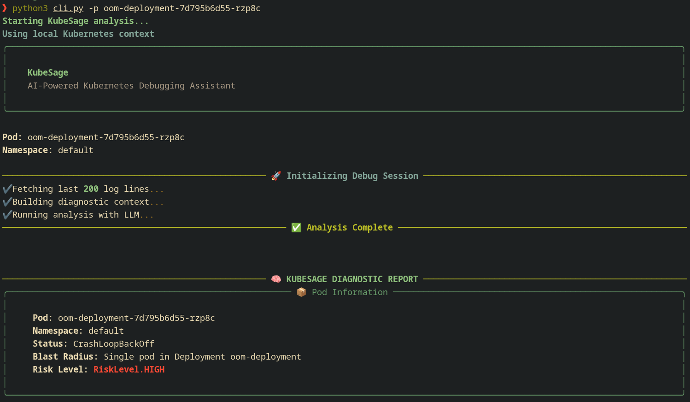
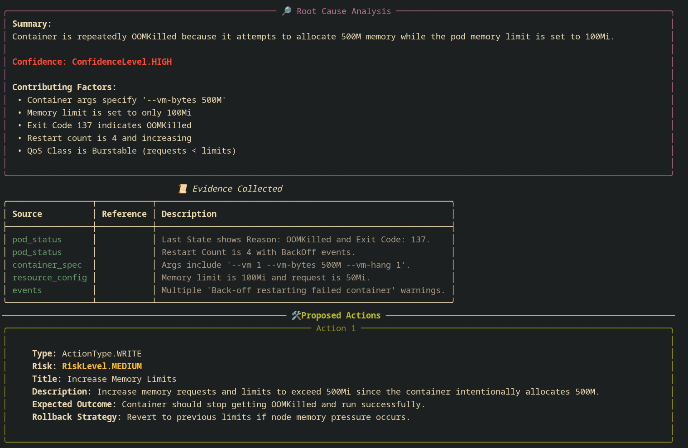
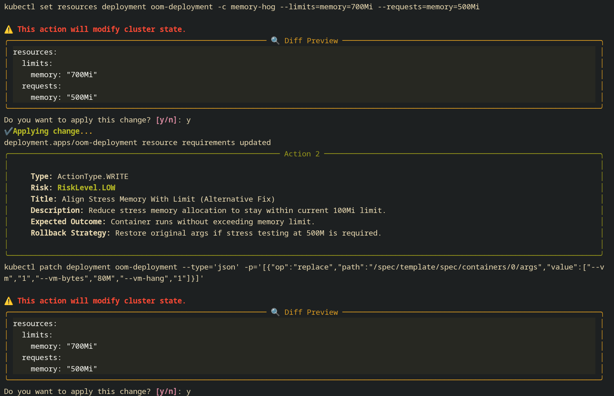
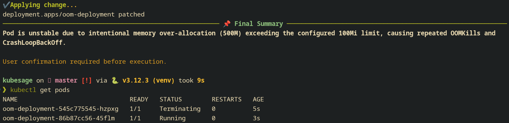
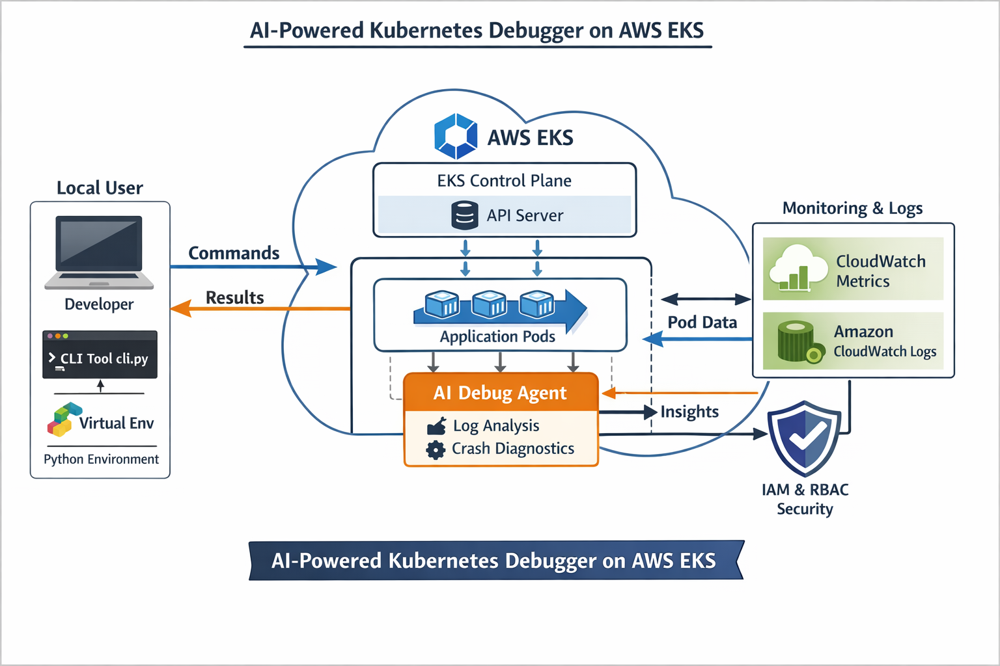

# ☸️ KubeSage

> AI-Powered Kubernetes Debugging Agent

KubeSage is an AI-driven Kubernetes debugging assistant that automatically analyzes failing pods and identifies root causes using Amazon Bedrock LLMs.

Instead of manually digging through logs, events, and YAML manifests, KubeSage performs automated root cause analysis and provides actionable remediation suggestions directly from your terminal.

See [examples/README.md](./examples/README.md)

## 🚀 Features

### ✨ AI-powered root cause analysis

Detects common Kubernetes failures such as:

- 🔁 CrashLoopBackOff
- 💥 OOMKilled
- 📦 ImagePullBackOff
- ⚙️ Misconfigured resources
- 📉 Resource starvation

### 🧠 GenAI reasoning

Powered by Amazon Bedrock using:

- Claude 3 Haiku – fast classification

### 📊 Structured debugging results

KubeSage provides:

- 🔍 Root cause
- ⚠ Risk level
- 💡 Suggested fix
- 📈 Confidence score

### 🖥️ Developer-friendly CLI

```bash
python cli.py --pod oom-deployment-86b87cc56-45flm
```

Example output:






## 🏗 Architecture

Below is the high-level architecture of KubeSage.



## ☁️ AWS Services Used

KubeSage integrates with several AWS services:

| Service                               | Purpose                               |
| ------------------------------------- | ------------------------------------- |
| **Amazon Bedrock**                    | LLM inference for debugging reasoning |
| **Amazon Elastic Kubernetes Service** | Managed Kubernetes cluster            |
| **Amazon Cloud Watch**                | Logs and Metrics                      |
| **AWS Lambda** _(optional)_           | Event-driven debugging                |
| **Amazon DynamoDB** _(optional)_      | Incident storage                      |
| **Amazon S3** _(optional)_            | Log archival                          |

## ⚙️ Tech Stack

### Core

- Python 3.10
- Typer (CLI framework)
- Rich (terminal UI)
- Pydantic (structured outputs)
- Kubernetes Python Client

### GenAI

- Amazon Bedrock
- Claude models from Anthropic

### AWS SDK

- strands – Bedrock invocation

## 🎯 Impact

KubeSage helps engineers:

- ⏱ Reduce Mean Time To Resolution (MTTR)
- 🔍 Automatically identify failure causes
- 🧠 Leverage GenAI-powered debugging
- ⚡ Respond faster to production incidents

## ⬇️ Installation

### 🐍 Using Conda

```bash
git clone https://github.com/naman22a/kubesage.git
cd kubesage
conda env create -f environment.yml
conda activate kubesage
```

### 🐍 Using pip

```bash
git clone https://github.com/naman22a/kubesage.git
cd kubesage
pip install -r requirements.txt
```

## 📖 Full Setup Guide

For complete setup instructions including:

- AWS IAM configuration
- AWS CLI installation
- Docker installation
- kubectl installation
- eksctl installation
- Creating an EKS cluster
- Running test workloads

See [examples/README.md](./examples/README.md)

## 🔐 AWS Setup (Bedrock)

1. Enable Amazon Bedrock in your AWS region.
2. Ensure model access is granted (Claude model).
3. Configure credentials:

```bash
aws configure
```

4. Set environment variables (if needed):

```bash
export AWS_REGION=us-east-1
```

## 📁 Code Structure

```
kubesage/
├── k8s/                  # K8s manifest files for testing
├── src/                  # Main source code
│   ├── agent.py
│   ├── constants.py
│   ├── custom_types.py
│   ├── fns.py
│   └── k8s.py
├── cli.py                # CLI entry point
├── environment.yml       # Conda environment
├── requirements.txt      # Python dependencies
```

## 🏆 Hackathon Submission

Project built for:

AI for Bharat Hackathon

## 🗒️ LICENSE

KubeSage is [GPL V3](./LICENSE)
